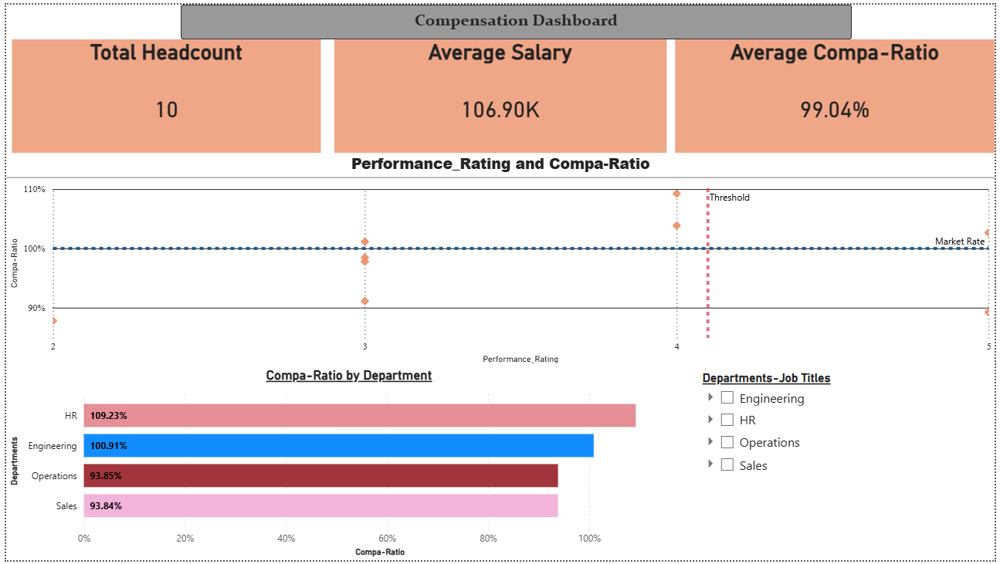
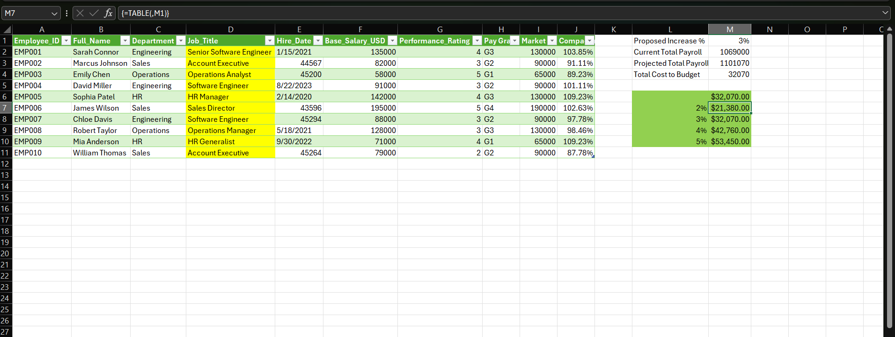

# HR Compensation Benchmarking & What-If Modeler

## Project Overview
This project serves as an end-to-end HR data pipeline and compensation analysis tool. It is designed to ensure data quality, automate entry salary calculations, and provide interactive "What-If" modeling for annual compensation and benefits (C&B) reviews.

## Tech Stack Used
* **Advanced Excel:** Power Query for data ingestion/cleaning, complex logical functions (`XLOOKUP`) for structural matrix calculations, and Data Tables for scenario modeling.
* **Power BI:** Data modeling, interactive data visualization, and executive reporting.

## Key Features & Responsibilities Showcased
1. **Data Quality & Consistency Engine:** Utilized Power Query to ingest raw employee data, standardize job taxonomies, and handle missing values, ensuring a clean foundation for analysis.
2. **Automated Salary Matrix:** Developed a dynamic Excel structural analysis using `XLOOKUP` to match employee titles to official pay grades and external market medians.
3. **C&B Benchmarking & What-If Scenarios:** Built a financial impact model comparing internal compa-ratios against external market data. Integrated an advanced Data Table "What-If" tool allowing leadership to toggle proposed structural salary increases (e.g., 2%, 3%, 5%) to instantly view the projected impact on the departmental budget.
4. **Interactive HR Dashboard:** Extracted modeled data into Power BI to create a dynamic reporting suite. The dashboard visualizes the correlation between yearly performance reviews and compensation, identifying potential pay equity and flight risks.

## Executive Dashboard

## Scenario Modeler (Excel Engine)

